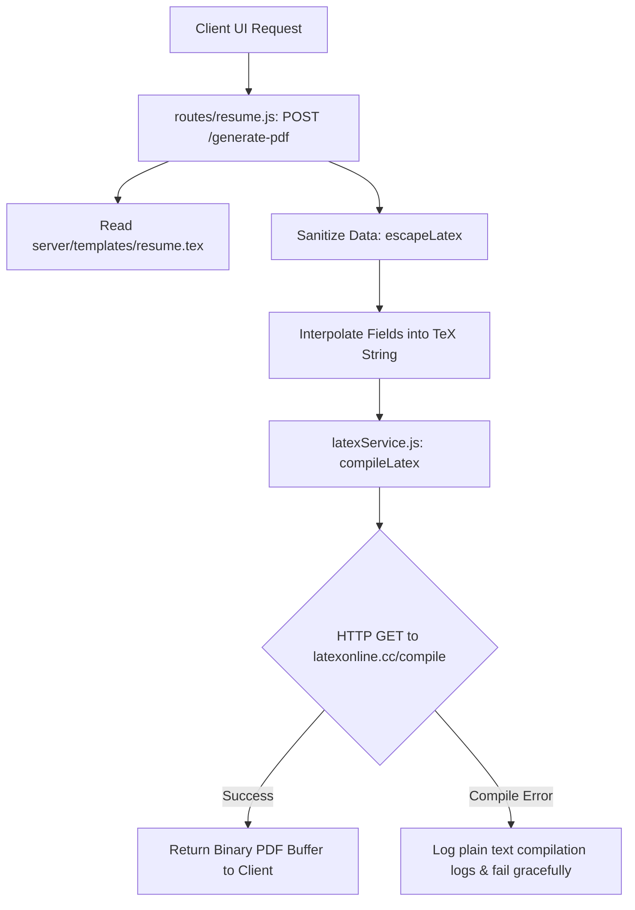
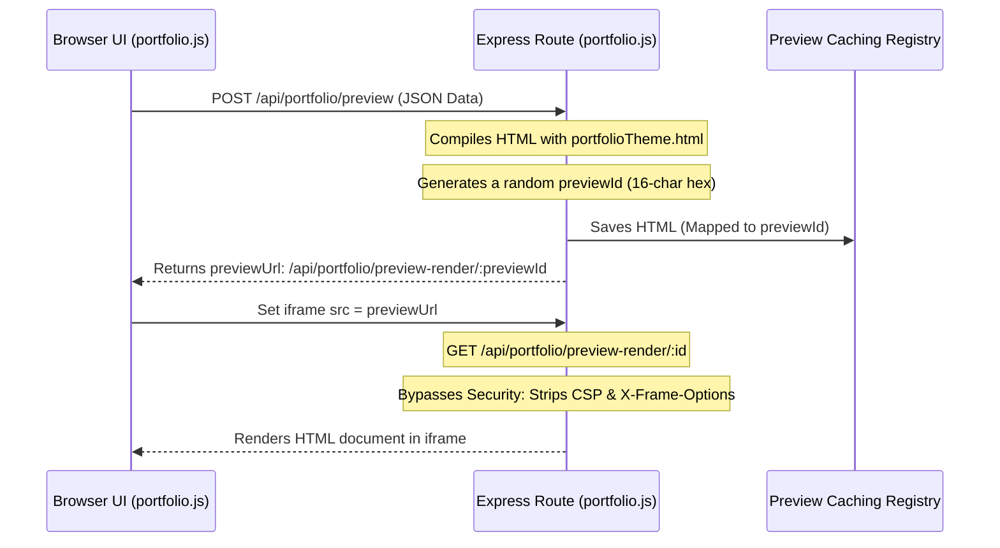

# AI Resume & Portfolio Builder

Welcome to the developer documentation and architecture guide for the **AI Resume & Portfolio Builder** (NextHire). This document functions as the core memory for the codebase, explaining the system's modular architecture, data flows, core services, and extensibility guidelines to help you confidently make updates, debug, or add new features.

---

## Table of Contents
1. [System Architecture Overview](#1-system-architecture-overview)
2. [Database Schema (`server/models`)](#2-database-schema-servermodels)
3. [Resume Builder Module](#3-resume-builder-module)
   - [Core Flow & Endpoints](#core-flow--endpoints)
   - [LaTeX PDF Compilation Pipeline](#latex-pdf-compilation-pipeline)
   - [ATS Score Computation Engine](#ats-score-computation-engine)
4. [Portfolio Builder Module](#4-portfolio-builder-module)
   - [Core Flow & Endpoints](#core-flow--endpoints-1)
   - [Resume Synchronization & Skill Categorization](#resume-synchronization--skill-categorization)
   - [Live Preview Architecture](#live-preview-architecture)
   - [ZIP Export Packaging Compiler](#zip-export-packaging-compiler)
5. [AI Service Pipeline (`server/services`)](#5-ai-service-pipeline-serverservices)
6. [Local Setup & Development](#6-local-setup--development)
7. [Developer Extension Memory (How-To Guides)](#7-developer-extension-memory-how-to-guides)

---

## 1. System Architecture Overview

The project is structured as a decoupled full-stack Node.js application, split between a static client frontend and an Express.js/MongoDB backend.

```
ai-resume-builder/
├── client/                     # Frontend Static Assets
│   ├── css/                    # Custom Styling
│   ├── js/                     # Client JavaScript Logic
│   │   ├── app.js              # Global state, Auth Check, & API Helper
│   │   ├── resume.js           # Resume UI Event handlers & rendering
│   │   └── portfolio.js        # Portfolio UI Event handlers, sync & iframe compiler
│   ├── index.html              # Landing Page / Signup & Login Forms
│   ├── resume.html             # Resume Builder Workspace
│   └── portfolio.html          # Portfolio Builder Workspace & Theme editor
├── server/                     # Backend Source Code
│   ├── middleware/
│   │   └── auth.js             # JWT Verification Middleware
│   ├── models/                 # Mongoose Database Schemas
│   │   ├── User.js
│   │   ├── Resume.js
│   │   └── Portfolio.js
│   ├── routes/                 # Express API Endpoint Handlers
│   │   ├── auth.js             # User Auth routes
│   │   ├── resume.js           # Resume CRUD, PDF & ATS routes
│   │   └── portfolio.js        # Portfolio CRUD, Preview, ZIP & AI routes
│   ├── services/               # Internal API/Service Integrations
│   │   ├── atsService.js       # ATS scoring implementation
│   │   ├── geminiService.js    # Gemini API wrapper (Primary AI)
│   │   ├── grokService.js      # xAI Grok API wrapper (Secondary/Fallback AI)
│   │   └── latexService.js     # External LaTeX to PDF compiler client
│   ├── templates/              # Base Generation Templates
│   │   ├── resume.tex          # Raw LaTeX template for resume layout
│   │   └── portfolioTheme.html # Base template for user websites
│   └── index.js                # App entry-point (Database connection & Middleware Setup)
├── .env                        # Local configurations (port, DB, and API keys)
├── package.json                # Project configurations & dependency versions
└── seed.js                     # Database Seeding Script (Admin & User accounts)
```

---

## 2. Database Schema (`server/models`)

The system uses three primary collections in MongoDB:

### `User` (`server/models/User.js`)
Stores basic authentication records.
- `email`: String (Unique, normalized, lowercase, required).
- `password`: String (Bcrypt-hashed hash).

### `Resume` (`server/models/Resume.js`)
Stores structural data representing the user's resume.
- `userId`: ObjectId (Reference to `User`, unique, required).
- `personalInfo`: Sub-schema (fullName, email, phone, location, linkedin, website).
- `summary`: String (Professional summary text).
- `experience`: Array of Sub-schemas (jobTitle, company, location, startDate, endDate, bulletPoints).
- `education`: Array of Sub-schemas (degree, school, year, percentage).
- `skills`: Array of Strings (Tag list).
- `projects`: Array of Sub-schemas (title, description, link, technologies).
- `jobDescription`: String (Target role description used for ATS scoring).

### `Portfolio` (`server/models/Portfolio.js`)
Stores customizable theme preferences and structural website data.
- `userId`: ObjectId (Reference to `User`, unique, required).
- `fullName`: String (Custom portfolio title).
- `profileImage`: String (Base64 data URL representing uploaded image).
- `syncFromResume`: Boolean (Default: `true`. Links fields directly to Resume when enabled).
- `tagline`: String (Header text).
- `bio`: String (Long bio description).
- `skills`: Array of Strings.
- `skillCategories`: Array of Sub-schemas (name, percentage, skills) - maps flat skills into 3 categorized proficiency meters.
- `stats`: Array of Sub-schemas (value, label) - exactly 4 stats, e.g., "500+" and "DSA Solved".
- `projects`: Array of Sub-schemas (title, description, link, image, technologies, order).
- `education`: Array of Sub-schemas (degree, school, year, percentage).
- `theme`: Sub-schema:
  - `primaryColor` (Hex value, default `#d2bbff`)
  - `secondaryColor` (Hex value, default `#bec6e0`)
  - `tertiaryColor` (Hex value, default `#3cddc7`)
  - `backgroundColor` (Hex value, default `#101415`)
  - `cardStyle` (`glassmorphic`, `bordered`, `glowing`, `flat`)
  - `font` (Default `Geist`)
- `socialLinks`: Sub-schema (github, linkedin, twitter).

---

## 3. Resume Builder Module

The Resume Builder lets users update details, compile their data into a LaTeX PDF template, and evaluate formatting and keyword composition against a target job description.

### Core Flow & Endpoints

1. **`GET /api/resume`**: Loads the authenticated user's resume. Returns empty schema objects if none exists.
2. **`PUT /api/resume`**: Saves/updates resume fields.
3. **`POST /api/resume/ai-suggest`**: Calls `geminiService` (with fallbacks) to rewrite the summary and bullet points.
4. **`POST /api/resume/ats-score`**: Calculates an ATS compatibility report.
5. **`POST /api/resume/generate-pdf`**: Constructs and compiles a PDF copy of the resume.

---

### LaTeX PDF Compilation Pipeline

The PDF compiler uses LaTeX for layout quality. Since LaTeX has strict compilation requirements, formatting must be parsed carefully.



#### Sanitize Function (`escapeLatex`)
To prevent raw symbols from throwing compilation errors, characters must be escaped:
- Backslashes `\` are converted to `\textbackslash{}`.
- Special symbols `&, %, $, #, _, {, }` are escaped with a prepended backslash (e.g. `\%`).
- Tildes `~` and carets `^` are converted to text equivalents.

#### Compilation Client (`server/services/latexService.js`)
The server sends the interpolated text document payload directly to the public REST server `https://latexonline.cc/compile` using the `axios` client. If the response content-type is `application/pdf`, the raw binary buffer is passed back to the route handler and piped to the user's browser as a file attachment download. If the API returns text log outputs, it parses the compilation failures and logs them directly to the console.

---

### ATS Score Computation Engine

The ATS evaluation implements a hybrid grading system containing both deterministic structural grading (40% weight) and AI parsing evaluation (60% weight).

```
Final ATS Score = (Deterministic Score * 0.4) + (AI Score * 0.6)
```

If the AI evaluation is offline (or `GROK_API_KEY` is missing), the system falls back gracefully to using the deterministic score as 100% of the grade.

#### 1. Deterministic Checks (`server/services/atsService.js`)
The deterministic grader evaluates 7 criteria:

| Check | Weight | Logic / Requirements |
| :--- | :--- | :--- |
| **Contact info completeness** | 15% | Deducts score for any missing core contact fields: `fullName`, `email`, `phone`, `location`. |
| **Professional summary length** | 10% | Validates that summary length is between 200 and 600 characters. |
| **Quantified achievements** | 20% | Scans work experience bullet points using a digit-matching regex (`/\d/`). Requires at least 3 bullets to contain numbers. |
| **Action verbs usage** | 15% | Verifies that at least 70% of experience bullet points begin with an active professional verb (e.g. *managed, developed, optimized, built*). |
| **No first-person pronouns** | 10% | Checks summary and bullets for pronoun terms (`i`, `me`, `my`). Active professional resumes require third-person styling. |
| **Length & density** | 15% | Requires a total word count between 250 and 700 words, and at least 5 listed skills. |
| **File-friendly formatting** | 15% | Rejects document contents containing invalid symbols or parser blockers (`\t`, `<`, `>`, `{`, `}`, `|`). |

#### 2. AI Evaluator (`evaluateResumeWithAI`)
Sends raw plain-text resume data along with the job description to the xAI Grok API. It directs the AI to evaluate keyword matching and return a JSON map containing a score, keyword match percentage, missing keywords array, strengths, and improvements.

---

## 4. Portfolio Builder Module

The Portfolio Builder allows users to construct websites, preview layouts dynamically in their browser, and export code structures as a self-contained static ZIP download.

### Core Flow & Endpoints

1. **`GET /api/portfolio`**: Fetch configuration preferences. Performs dynamic synchronization calculations if resume-linking is enabled.
2. **`PUT /api/portfolio`**: Saves user configuration preferences.
3. **`POST /api/portfolio/preview`**: Registers temporary preview documents in the server caching registry.
4. **`GET /api/portfolio/preview-render/:id`**: Serves preview HTML for iframe integration.
5. **`POST /api/portfolio/ai-suggest`**: Calls `geminiService` to write taglines, stats, project enhancements, and skill categories.
6. **`POST /api/portfolio/download-zip`**: Packages portfolio HTML, CSS, JS, and user images into a single static ZIP.

---

### Resume Synchronization & Skill Categorization

When `syncFromResume` is checked (`true`), the portfolio dynamically fetches and adapts fields from the user's resume record on `GET` requests:

```
[Resume Model] ──(Sync Activated)──> [Portfolio Controller]
                                           │
                                           ├─► Full Name / Bio / Education Sync
                                           ├─► Project mapping (Maintains order & images)
                                           └─► Flat Skills grouped into Categories
```

#### Skill Categorization Algorithm (`groupSkills`)
To fit the portfolio's visual dashboard grid, the backend splits the user's flat array of skills into exactly three buckets:
1. **Frontend Mastery**: Matches keywords like `react`, `vue`, `html`, `css`, `javascript`, `tailwind`, `svelte`, etc.
2. **Backend & DB**: Matches keywords like `node`, `django`, `spring`, `java`, `python`, `sql`, `mongo`, `graphql`, `redis`, etc.
3. **Logic & Ops**: Stores remaining skills (e.g., `git`, `dsa`, `docker`, `kubernetes`).

*Fallback Mechanism:* If any lists are empty or sparse, the system injects default presets (e.g., `HTML5`, `CSS3`, `React` for Frontend) to maintain layout consistency.

---

### Live Preview Architecture

To render previews without compromising browser security, the app uses a temporary cached session approach.



#### Caching Registry Details
- Previews are stored inside an in-memory `Map` keyed by `previewId`.
- Every time a preview is generated, the server automatically cleans up entries older than 10 minutes to prevent memory leaks.

---

### ZIP Export Packaging Compiler

The `POST /api/portfolio/download-zip` endpoint generates a production-ready static website bundle using `adm-zip`.

```
portfolio_project.zip
├── index.html       # Base HTML content (Linked to style.css and app.js)
├── style.css        # Theme styles & variables compiled from cardStyle configuration
├── app.js           # Scroll spy & skill progression intersection observer
└── images/          # Extracted image files (Profile photo & Project cards)
```

#### Base64 Binary Extraction
To export images uploaded via the browser, the ZIP builder parses base64-encoded Data URLs:
1. Matches the base64 prefix: `data:image/(?<ext>[a-zA-Z0-9+]+);base64,(?<data>.+)`.
2. Resolves the correct file extension (`.jpg`, `.png`, `.webp`).
3. Converts the raw base64 string back into a binary file buffer: `Buffer.from(data, 'base64')`.
4. Saves files to `images/profile.[ext]` or `images/project_[index].[ext]`.
5. Updates paths inside `index.html` to point to the local file layout before packaging.

---

## 5. AI Service Pipeline (`server/services`)

The system relies on a pipeline of AI integrations with robust fallbacks:

```
[Service Call] ──► [Gemini 2.5 Flash API]
                          │
                   (Failure/No Key)
                          │
                          ▼
                 [xAI Grok Beta API]
                          │
                   (Failure/No Key)
                          │
                          ▼
             [Offline Local Mock Presets]
```

### AI Services Mapping
- **`geminiService.js`**: Contains logic for:
  - `generatePortfolioAIContent`: Builds custom developer tags, timelines, bios, taglines, and projects.
  - `suggestResumeImprovements`: Rewrites summaries and experiences to match a job description.
- **`grokService.js`**: Used as a direct fallback for portfolio suggestion errors and acts as the engine for ATS keyword matching.
- **Offline Fallback**: Evaluates data structure input patterns (e.g. matching for `java` keywords) and returns high-quality mockup responses instantly.

---

## 6. Local Setup & Development

### 1. Prerequisites
- **Node.js**: v20.0.0 or higher.
- **MongoDB**: A running local instance (running on port `27017` with database name `resume-portfolio`).

### 2. Configuration (`.env`)
Create a `.env` file in the root directory:
```env
PORT=5000
MONGO_URI=mongodb://127.0.0.1:27017/resume-portfolio
JWT_SECRET=your_ultra_secure_jwt_secret_key_987654321_abcdef

# AI Integrations
GEMINI_API_KEY=YOUR_GEMINI_API_KEY
GROK_API_KEY=YOUR_GROK_API_KEY
```

### 3. Build & Run
```bash
# Install NPM dependencies
npm install

# Run database seeder (seeds default user accounts)
node seed.js

# Start application under nodemon (Development mode)
npm run dev
```

*Default Seeder Credentials:*
- **Admin**: `admin@example.com` / `admin123`
- **User**: `user@example.com` / `user123`

---

## 7. Developer Extension Memory (How-To Guides)

### A. How to Add a New Portfolio Layout/Style
Card styles are configured in [Portfolio.js](file:///c:/Users/Siddhesh/Desktop/ai%20resume%20builder/server/models/Portfolio.js). To add a new card design (e.g. `minimalist`):
1. **Extend Schema Options**: Update the comment in `ThemeSchema.cardStyle` list.
2. **Implement Styles**:
   - Open `server/routes/portfolio.js` and locate `compilePortfolioHtml()`.
   - Add a new block inside the `styleChoice` condition block (approx. line 374):
     ```javascript
     else if (styleChoice === 'minimalist') {
       cardStyleCss = `
           .theme-card {
               background: transparent;
               border-bottom: 1px solid ${primaryColor}40;
           }
           .theme-card-hover:hover {
               border-color: ${primaryColor};
               transform: translateX(4px);
               transition: all 0.3s ease;
           }
       `;
     }
     ```
   - Make sure to update the matching styling rules inside `POST /download-zip` (approx. line 768) so that exported portfolios match the style option.
3. **Extend Client Form**:
   - Open [portfolio.html](file:///c:/Users/Siddhesh/Desktop/ai%20resume%20builder/client/portfolio.html) and locate the select dropdown `#theme-card-style`. Add your option:
     ```html
     <option value="minimalist">Minimalist (Underlined)</option>
     ```

### B. How to Add a New ATS Rule Check
To add a new rule check (e.g., verifying if a GitHub/LinkedIn link is listed inside the contact info):
1. **Extend Check Rules**:
   - Open [atsService.js](file:///c:/Users/Siddhesh/Desktop/ai%20resume%20builder/server/services/atsService.js) and locate `calculateRuleBasedScore()`.
   - Define a rule check block (reduce/allocate weight proportionally):
     ```javascript
     const hasSocials = personalInfo.linkedin && personalInfo.linkedin.trim() !== '';
     const socialScore = hasSocials ? 10 : 0;
     totalScore += socialScore;
     breakdown.push({
       check: "Social media links presence",
       passed: hasSocials,
       scoreContribution: socialScore,
       suggestion: hasSocials 
         ? "Professional social link is configured." 
         : "Add a LinkedIn profile to increase recruiter response rates."
     });
     ```
   - Adjust weights on other checks (the total weight of all checks combined should sum to exactly `100`).
